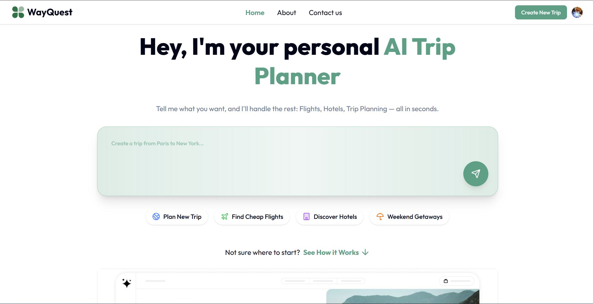

<div align="center">

# 🌍 WayQuest AI - Your Smart Trip Planner

**Craft personalized travel itineraries in seconds with the power of AI.**

*No more endless scrolling and planning stress. Just tell WayQuest AI your preferences, and get a custom-made, map-integrated travel plan instantly.*

</div>

<p align="center">
  <a href="https://wayquestai.vercel.app" target="_blank">
    
  </a>
  &nbsp;
  <a href="https://github.com/MKG0007/Ai-Trip-Planner" target="_blank">
    
  </a>
</p>

<div align="center">



</div>

---

## ✨ Core Features

WayQuest AI combines cutting-edge technology to deliver a seamless and intelligent travel planning experience.

| Feature                  | Description                                                                 | Technology Used                                                                      |
| ------------------------ | --------------------------------------------------------------------------- | ------------------------------------------------------------------------------------ |
| 🤖 **AI Itinerary Engine** | Generates complete, personalized travel plans based on user input.          |        |
| 🗺️ **Interactive Maps** | Visualizes routes and destinations in real-time for easy navigation.        |                  |
| 🔐 **Secure User Accounts** | Provides safe and easy authentication for managing your trips.              |                     |
| ⚡ **Real-time Database** | Ensures your trip data is always in sync across devices with a fast backend. |                  |
| 🎨 **Responsive UI/UX** | Offers a clean, modern, and intuitive interface on any device.              |   |
| 🚀 **Seamless Deployment** | Hosted for high performance and reliability.                                |       |

---

## 🛠️ Tech Stack

This project is built with a modern, scalable, and efficient technology stack.

-   **Frontend:** **Next.js** with **React** & **TypeScript**
-   **Styling:** **Tailwind CSS**
-   **Backend & Database:** **Convex**
-   **AI Integration:** **Google Gemini API**
-   **Mapping:** **Mapbox API**
-   **Authentication:** **Clerk**
-   **Deployment:** **Vercel**

---

## ⚙️ Getting Started

Follow these steps to set up and run the project locally on your machine.

### Prerequisites
- Node.js (v18 or newer)
- npm or yarn

### 1. Clone the Repository
First, clone the project repository to your local machine.
```bash
git clone [https://github.com/MKG0007/Ai-Trip-Planner.git](https://github.com/MKG0007/Ai-Trip-Planner.git)
cd Ai-Trip-Planner
```

### 2. Install Dependencies
Install all the required npm packages.
```bash
npm install
```

### 3. Set Up Environment Variables
Create a `.env.local` file in the root of your project and add the following keys. You will need to get these API keys from their respective platforms.

```env
# .env.local

# Google Gemini API Key
NEXT_PUBLIC_GEMINI_API_KEY="YOUR_GEMINI_API_KEY"

# Mapbox Access Token
NEXT_PUBLIC_MAPBOX_TOKEN="YOUR_MAPBOX_TOKEN"

# Convex Deployment URL
NEXT_PUBLIC_CONVEX_URL="YOUR_CONVEX_URL"

# Clerk Publishable Key
NEXT_PUBLIC_CLERK_PUBLISHABLE_KEY="YOUR_CLERK_PUBLISHABLE_KEY"

# Clerk Secret Key
CLERK_SECRET_KEY="YOUR_CLERK_SECRET_KEY"
```

### 4. Run the Development Server
Start the development server to view the application.
```bash
npm run dev
```
Open [http://localhost:3000](http://localhost:3000) in your browser to see the result.

---

## 📸 More Screenshots

<details>
<summary><strong>Click to expand and see more images</strong></summary>
<br>

**AI Itinerary Generation Page**


_You can add more screenshots here to showcase different parts of your application!_

</details>

---

## 🤝 Contributing

Contributions are welcome! If you have ideas for improvements or want to fix a bug, please feel free to:

1.  **Fork** the repository.
2.  Create a new **branch** (`git checkout -b feature/your-feature-name`).
3.  **Commit** your changes (`git commit -m 'Add some amazing feature'`).
4.  **Push** to the branch (`git push origin feature/your-feature-name`).
5.  Open a **Pull Request**.

---

## 📜 License

This project is licensed under the MIT License. See the [LICENSE](LICENSE) file for details.

```
